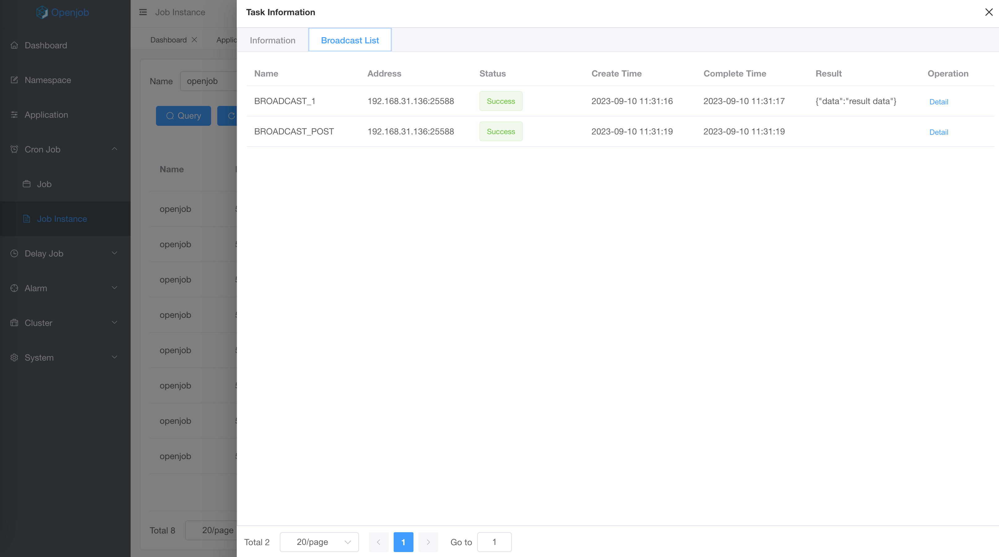

# Broadcast

广播任务类型的任务实例会广播到应用对应的所有Worker上执行，当所有Worker都执行完成，该任务才算完成，任意一台Worker执行失败，任务就算失败。

### 应用场景
##### 批量操作
- 定时广播所有机器运行某个脚本。
- 定时广播所有机器清理数据。
- 动态启动每台机器的某个服务

##### 数据聚合
- 使用JavaProcessor->preProcess 初始化
- 每台机器执行 process 时，根据自己业务返回 result。
- 执行 postProcess，获取所有机器的执行结果做汇总。

### 任务特性
广播任务类型可以选择多种，例如脚本或者Java任务。如果选择Java，还支持preProcess和postProcess高级特性。

- preProcess 会在每台机器执行 process 之前执行，且只会执行一次。
- process 每天机器实际任务执行逻辑。
- postProcess 会在每台机器执行 process 完成且都成功执行之后执行一次，可以返回结果，作为工作流数据传输。

## 示例
如下使用注解方式定义执行器

```java
/**
 * @author stelin swoft@qq.com
 * @since 1.0.7
 */
@Component("broadcastPostProcessor")
public class BroadcastProcessor implements JavaProcessor {
    private static final Logger logger = LoggerFactory.getLogger("openjob");

    @Override
    public void preProcess(JobContext context) {
        logger.info("Broadcast pre process!");
    }

    @Override
    public ProcessResult process(JobContext context) throws Exception {
        logger.info("Broadcast process!");
        return new ProcessResult(true, "{\"data\":\"result data\"}");
    }

    @Override
    public ProcessResult postProcess(JobContext context) {
        logger.info("Broadcast post process taskList={}", context.getTaskResultList());
        System.out.println(context.getTaskResultList());
        return ProcessResult.success();
    }
}
```

### Task Detail

