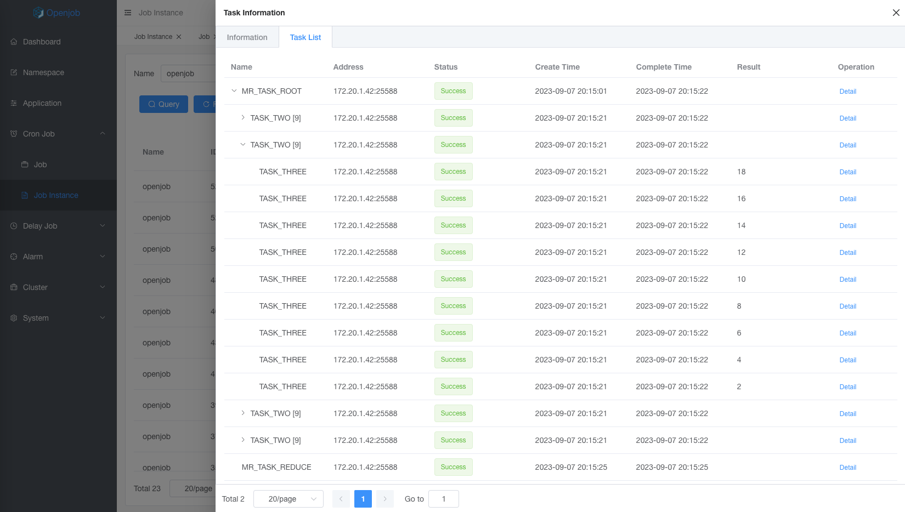

# Map Reduce

MapReduce is a lightweight distributed batch task. Implemented by the MapProcessor or MapReduceProcessor. Compared with big data batch task (such as Hadoop, Spark, etc.), MapReduce does not need to import data into the big data platform, and has no additional storage and computing costs. It can realize second data processing and the advantages of low cost, fast speed and programming.

:::tip
- If reduce is used, all subtask results will be cached in the worker node. This puts a lot of pressure on the worker node memory. Recommended that the number of subtasks and the result return value should not be too large. If no need for reduce, use the MapProcessor.
- Openjob does not that subtasks will be executed exactly once. Retry will occur under special conditions, which may result in repeated execution of subtasks, requiring the business to implement idempotence.
:::

## Example

Define executor by annotation as follows:

```java
/**
 * @author stelin swoft@qq.com
 * @since 1.0.7
 */
@Component("mapReduceTestProcessor")
public class MapReduceTestProcessor implements MapReduceProcessor {
    private static final Logger logger = LoggerFactory.getLogger("openjob");

    private static final String TWO_NAME = "TASK_TWO";

    private static final String THREE_NAME = "TASK_THREE";

    @Override
    public ProcessResult process(JobContext context) {
        if (context.isRoot()) {
            List<MapChildTaskTest> tasks = new ArrayList<>();
            for (int i = 1; i < 5; i++) {
                tasks.add(new MapChildTaskTest(i));
            }

            logger.info("Map Reduce root task mapList={}", tasks);
            return this.map(tasks, TWO_NAME);
        }

        if (context.isTask(TWO_NAME)) {
            MapChildTaskTest task = (MapChildTaskTest) context.getTask();
            List<MapChildTaskTest> tasks = new ArrayList<>();
            for (int i = 1; i < task.getId()*2; i++) {
                tasks.add(new MapChildTaskTest(i));
            }

            logger.info("Map Reduce task two mapList={}", tasks);
            return this.map(tasks, THREE_NAME);
        }

        if (context.isTask(THREE_NAME)) {
            MapChildTaskTest task = (MapChildTaskTest) context.getTask();
            logger.info("Map Reduce task three mapTask={}", task);
            return new ProcessResult(true, String.valueOf(task.getId() * 2));
        }

        return ProcessResult.success();
    }

    @Override
    public ProcessResult reduce(JobContext jobContext) {
        List<String> resultList = jobContext.getTaskResultList().stream().map(TaskResult::getResult)
                .collect(Collectors.toList());
        logger.info("Map Reduce resultList={}", resultList);
        return ProcessResult.success();
    }

    @Data
    @AllArgsConstructor
    @NoArgsConstructor
    public static class MapChildTaskTest {
        private Integer id;
    }
}
```

### Task Detail

