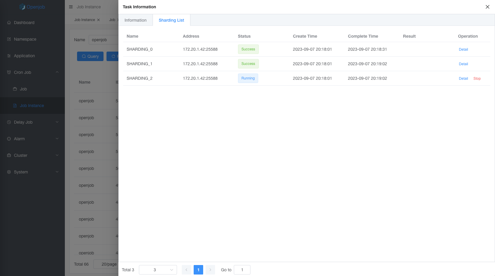

# Sharding

Sharding model includes static sharding and dynamic sharding:
- Static sharding: The main scenario is to process a fixed number of sharding. For example, there are 256 databases in sub-databases, which requires many worker to be processed in a distributed.
- Dynamic sharding: The main scenario is distributed processing of unknown data. For example, a large table is constantly changing and requires distributed batch running.

## Feature

- Compatible with elastic-job’s static sharding.
- Supports languages: Java, PHP, Python, Shell, and Go.
- High availability: When the worker that executes a sharding task becomes abnormal, it will be dynamically assigned to other normal worker to execute the task.
- Flow control: You can set the number of concurrent subtasks for a single worker. For example, if there are 100 sharding and a total of 3 worker, up to 5 sharding can be controlled to execute concurrently, and the others are waiting in the queue.
- Retry on failure: Automatically retry when subtask execution fails.

## Example

Define executor by annotation as follows:

```java

/**
 * @author stelin swoft@qq.com
 * @since 1.0.7
 */
@Component
public class ShardingAnnotationProcessor {
    private static final Logger logger = LoggerFactory.getLogger("openjob");

    @Openjob("annotationShardingProcessor")
    public ProcessResult shardingProcessor(JobContext jobContext) {
        logger.info("Sharding annotation processor execute success! shardingId={} shardingNum={} shardingParams={}",
                jobContext.getShardingId(), jobContext.getShardingNum(), jobContext.getShardingParam());
        logger.info("jobContext={}", jobContext);
        return ProcessResult.success();
    }
}
```

- `jobContext.getShardingId()` Sharding id
- `jobContext.getShardingParam()` Sharding params
- `jobContext.getShardingNum()` Sharding number

### Task Detail

