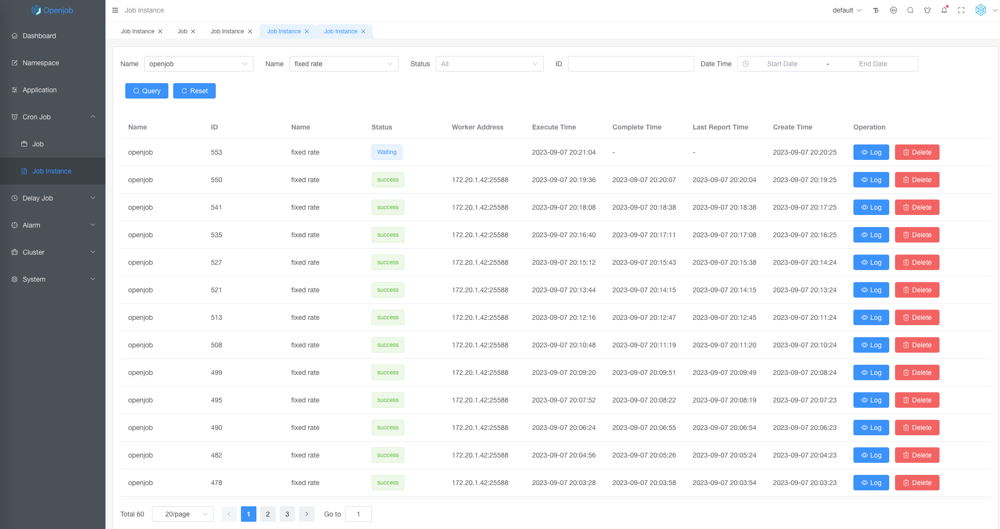

# Fixed Rate

Crontab must be divisible by 60, if task executed every 50 minutes, Crontab cannot support it.

:::info
Fixed Rate is used to regular polling, and the expression is simple, but it does not support second delay (Must greater than 60s).

:::

## Task Detail

