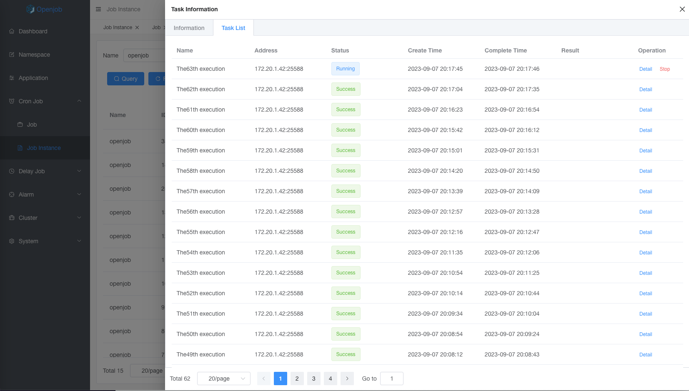

# Second Delay

Second delay support scheduling at interval of 1 to 60 seconds. After each task execution is completed, scheduling will be triggered again at second intervals. 

:::danger
Second delay only support 1~60 seconds
:::

### Feature

- High reliability: Second delay have high reliability characteristics. If a machine goes down, it can be re-run on another machine.
- Rich task types: Second delay belong to the cron type and can be applied to all task types and execution types.

### Task Detail

- Display status of each executed task
- Running tasks support termination
- `Details` to view the task running log