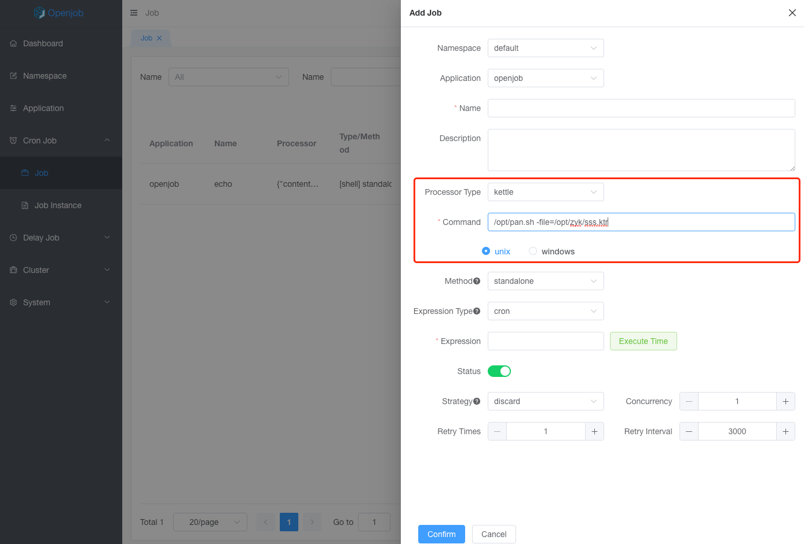

# Kettle

Worker client with a built-in kettle executor, and supports Unix and Windows.

:::tip
1. If you only need to use the script executor, `openjob-worker-agent` is easy to use.
2. Kettle executor automatically adds a prefix before execution based on the configured environment
    - unix (`/bin/sh -c ...`)
    - windows (`cmd.exe /c ...`)
:::