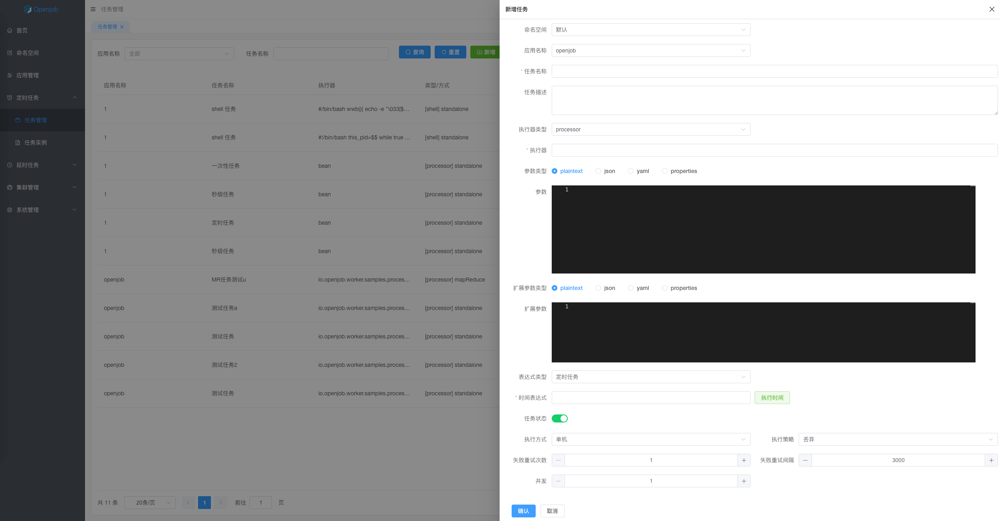
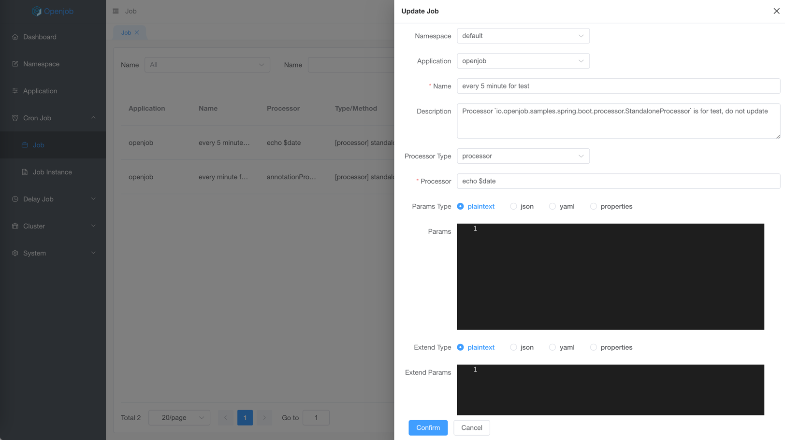
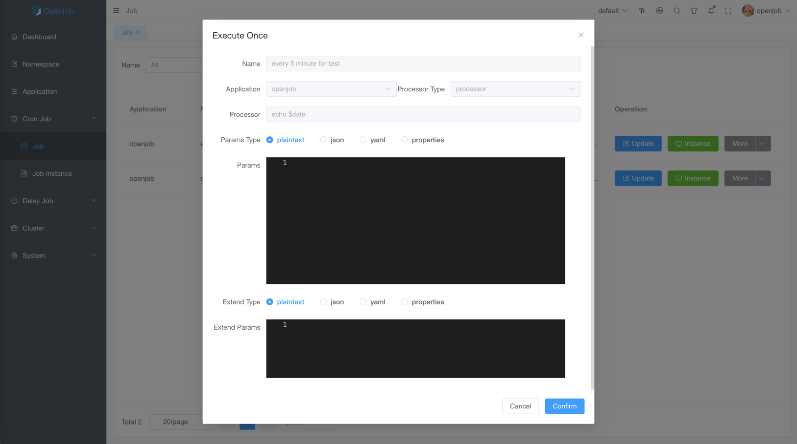
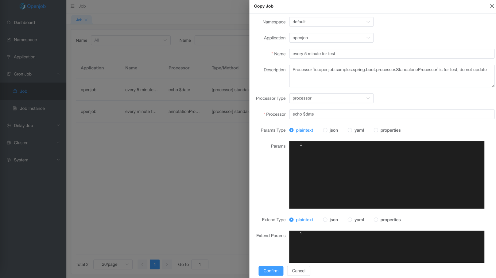
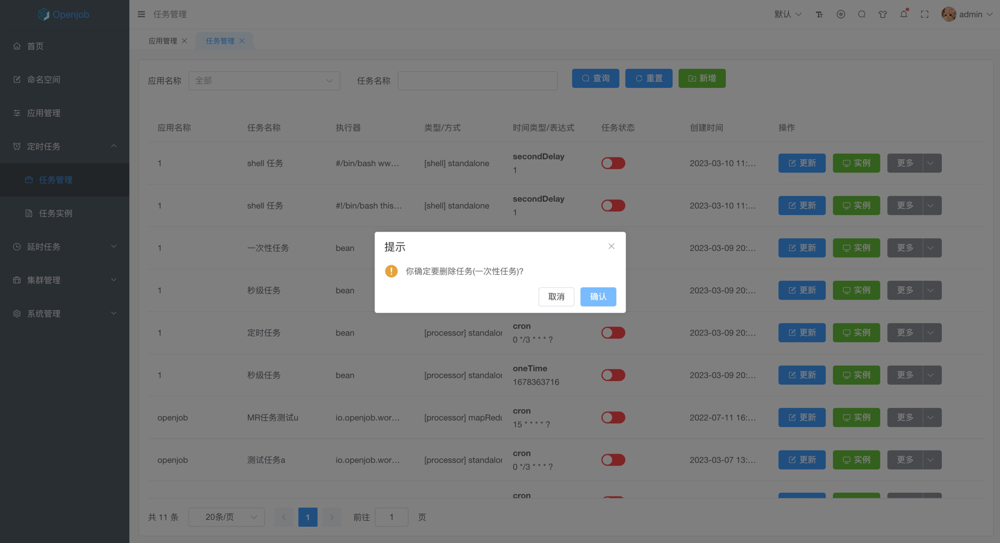

# Job

## Add

### Base Information

- Namespace: select one namespace
- Application: select one application
- Job name: max 32 characters
- Job description: max 128 characters

### Processor Type
- Processor: Java/Golang/PHP by code
- Shell: shell script
- Http: http request, used to periodically request an HTTP

### Job Params Type
- plaintext: text params
- json: JSON params
- yaml: YAML params
- properties: properties params

:::tip
json/yaml/properties format must be parsed in the job, because params is strings
:::

### Job Params
:::danger
Job params type must be consistent with job params format.
:::

### Extend Params Type
- plaintext: text params
- json: JSON params
- yaml: YAML params
- properties: properties params

> Extend params generally used to pass common task params ,like HTTP header.

:::tip
json/yaml/properties format must be parsed in the job, because params is strings
:::

### Extend Params
:::danger
Extend params type must be consistent with extend params format.
:::

### Expression Type
- Cronjob：Execute based on the configured time expression
- Second：Loop Execution ranging from 1s to 60s 
- Fixed Rate：Execute by fixed rate
- Onetime：Execute only once

:::tip
- Select right expression type by scenario
- Cronjob mini interval is minute.
:::

### Execute Type
- Standalone: Execute on a worker client
- Broadcast: Execute on all worker clients
- Map Reduce: Lightweight distributed computing,used to execute tasks in complex task scheduling and computing
- Sharding: Execute on worker client by sharding.

### Execute Strategy
- Discard: Discard after task
- Override: Override before task
- Concurrent: Execute tasks concurrently

### Others

- Retry Times: Retry times
- Retry Interval: Retry interval
- Concurrent: Number of concurrent tasks executed in the same time

:::tip
Number of concurrent tasks is equal to MR subtasks
:::

## Update

:::tip
New scheduling task will be effected when update time expression, execute time, retry params
:::

## Execute Once

Execute Once generally used to develop, params list:
- Job params type
- Job params
- Extend params type
- Extend params

:::info
Execute cannot custom params
:::

## Copy

:::info
Copy one job as another job.
:::

## Delete

- Not support to batch delete

:::danger
Job cannot be recovered after deleted
:::