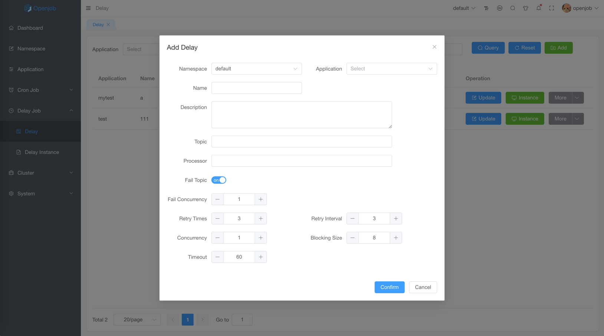
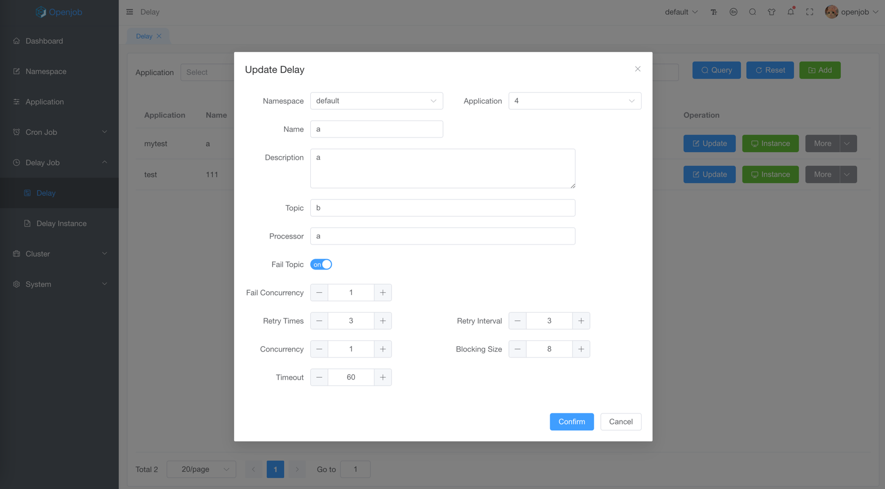
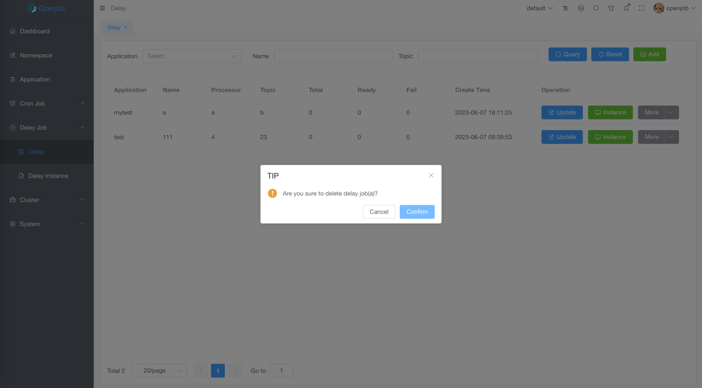

# Delay

## Add

- Name: contains max 128 characters
- Description: contains max 256 characters
- Topic: like RocketMq/Kafka Topic，letters, numbers, `.`,`_`,`-` and must global unique
    - Concurrent: consumer concurrent
- Processor: delay task execution processor
- Fail Topic: fail topic
    - Fail Concurrent: fail consumer concurrent
- Retry Params: 
    - Retry Times: retry times
    - Retry Interval: retry interval(s)
- Blocking Size: consumer blocking size
- Timeout: execute timeout(s), when execute time granter than this, will be rescheduled a new task.

:::tip
- When fail topic enable, consumer fail and reach retry times will be forwarded to fail topic
- When fail topic disable, consumer fail and reach retry times will be discarded
:::

## Update

:::info
Delay update takes effect in real time
:::

## Copy

:::info
Copy one as another
:::

## Delete

- Not support to batch delete

:::danger
Delay cannot be recovered after deleted
:::