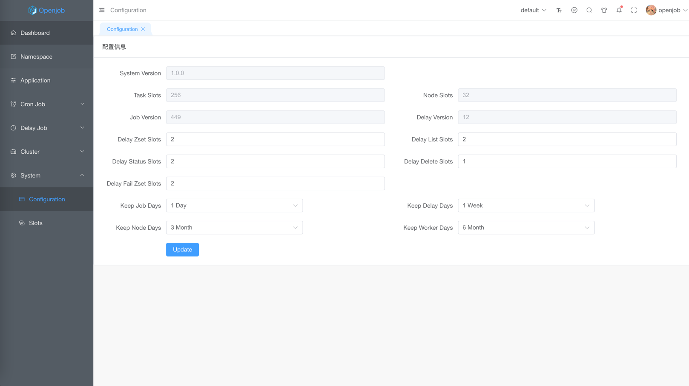

# Configuration

- System Version: Current system version
- Task Slots: System task slots
- Node Slots: Worker client slots.
- Job Version: Cluster job version, always increases
- Delay Version: Cluster delay version
- Delay Zset Slots: Delay zset slots.
- Delay List Slots: Delay list queue slots.
- Delay Status Slots: Delay status slots
- Delay Delete Slots: Delay delete  slots
- Delay Fail Zset Slots: Delay fail zset slots
- Keep Job Days: Keep the last days for job instance
- Keep Delay Days: Keep the last days for delay instance
- Keep Node Days: Keep the last days for cluster node instance
- Keep Worker Days: Keep the last days for worker client instance

:::tip
- Default system slots is 256, when update slots, will be migrated task 
- When you update configurations with delay tasks, only new tasks are affected.
:::