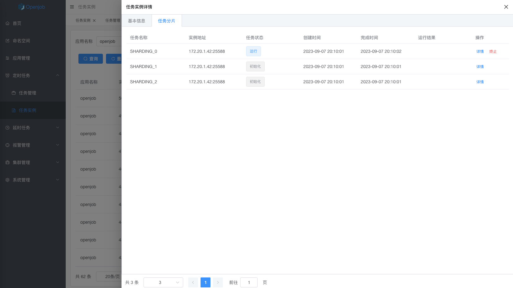

# 静态分片
分片模型主要包含静态分片和动态分片:
- 静态分片：主要场景是处理固定的分片数，例如分库分表中固定 256 个库，需要若干台机器分布式去处理。
- 动态分片：主要场景是分布式处理未知数据量的数据，例如一张大表在不停变更，需要分布式跑批。此时需要使用 MapReduce 任务

### 特性

- 兼容 elastic-job 的静态分片模型。
- 支持 Java、PHP 、Python、Shell、Go四种语言。
- 高可用：分片任务执行机器异常时，会动态分配到其它正常机器执行任务。
- 流量控制：可以设置单机子任务并发数。例如有 100 个分片，一共 3 台机器，可以控制最多 5 个分片并发执行，其它在队列中等待。
- 失败重试：子任务执行失败异常时，自动重试。

