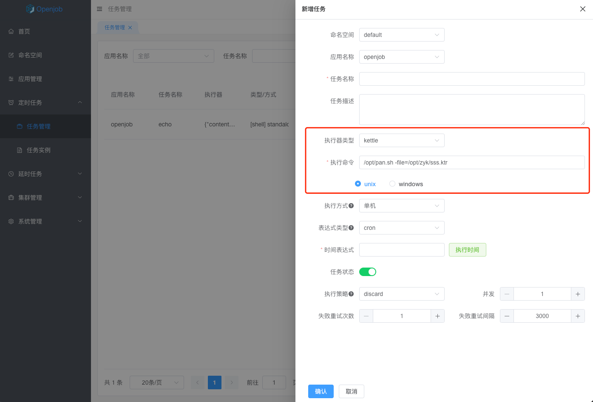

# Kettle 执行器

Worker 客户端内置 Kettle 执行器，用户无需单独实现，同时支持 Unix 和 Windows.

:::tip
1. 如果只是 Kettle 执行器，可以直接使用 `openjob-worker-agent` 方便简单。
2. Kettle 执行器自动根据配置环境，加上执行前缀
    - unix (`/bin/sh -c ...`)
    - windows (`cmd.exe /c ...`)
:::