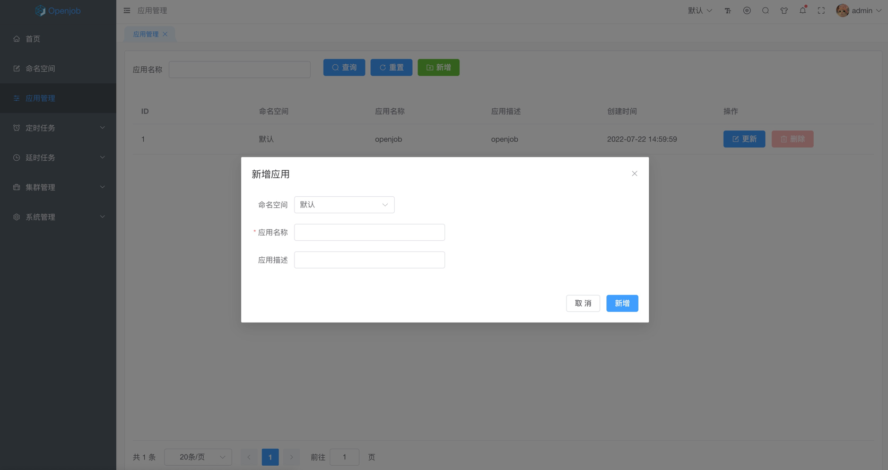
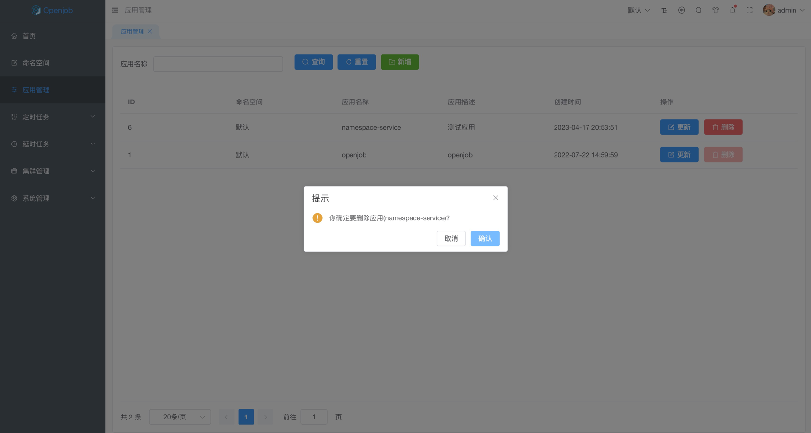

# 应用管理

## 新增应用

- 应用名称格式为英文字母、数字、.、_或-，且必须全局唯一(跨命名空间)
- 应用名称最大支持 64 个字符，应用描述最大支持 256 个字符

:::tip
一个服务同语言规划为一个应用，建议应用名称为服务名称，有利于后续维护管理。
:::

## 更新应用

- 只支持更新应用名称和应用描述

## 删除应用

- 只支持单个删除应用，且删除前二次确认
- 默认应用不支持删除

:::danger
应用删除后不可恢复，请谨慎操作。
:::