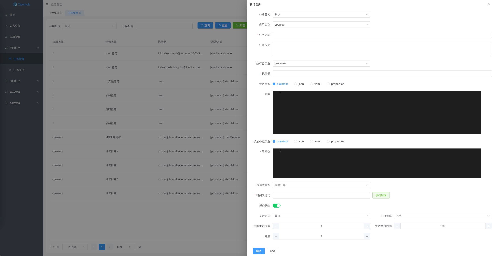
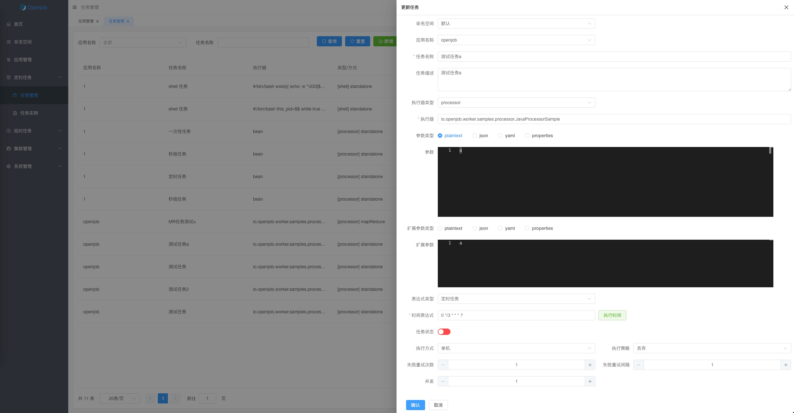
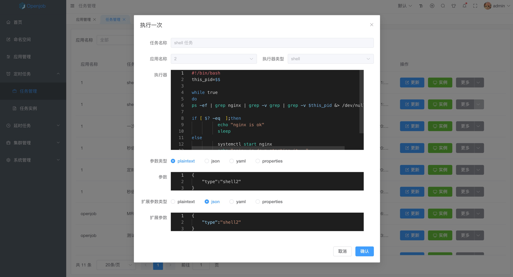
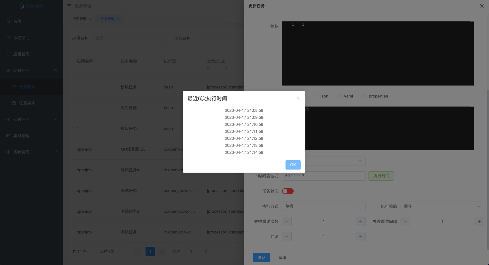

# 任务管理

## 新增任务

### 基本信息
 - 命名空间
 - 应用名称
 - 任务名称
 - 任务描述

### 执行器类型
  - 普通处理器
  - shell
  - http

### 任务参数类型
  - plaintext
  - json
  - yaml
  - properties

### 任务参数

### 扩展参数类型
  - plaintext
  - json
  - yaml
  - properties

### 扩展参数

### 表达式类型
  - 定时任务
  - 秒级任务
  - 固定频率
  - 一次性

### 执行方式
  - 单机
  - 广播
  - Map Reduce
  - 分片

### 执行策略
  - 丢弃
  - 覆盖
  - 并发

### 其它配置

- 失败重试次数
- 失败重试间隔
- 并发

## 更新任务

## 执行任务

## 复制任务

## 删除任务

- 只支持单个删除命任务，且删除前二次确认

:::danger
任务删除后不可恢复，请谨慎操作。
:::