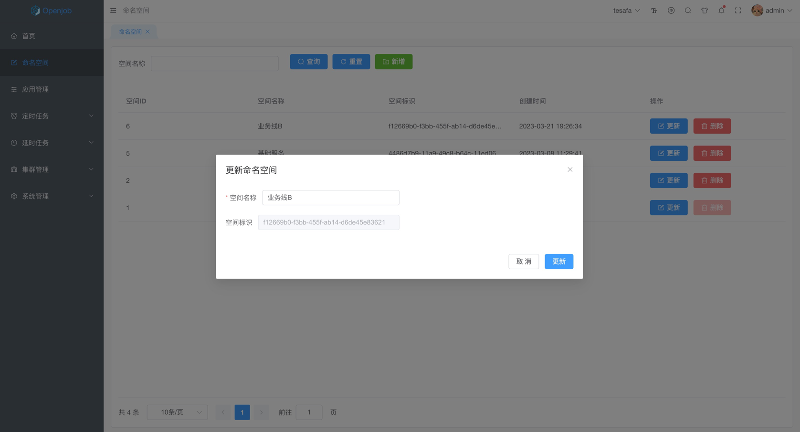
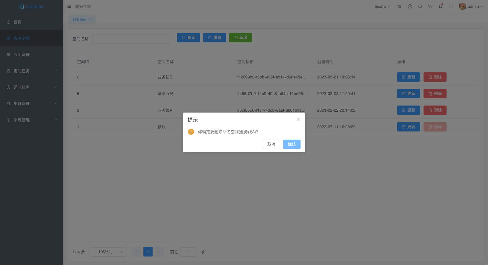

# 命名空间

## 新增命名空间

- 命名空间名称最大支持 64 个字符
- 命名空间名称不能重复

:::tip
建议按产品线或业务线规划命名空间，便于权限管控。
:::

## 更新命名空间

- 命名空间只支持更新名称，空间唯一标识不支持更新

## 删除命名空间

- 只支持单个删除命名空间，且删除前二次确认
- 默认命名空间不支持删除

:::danger
命名空间删除后不可恢复，请谨慎操作。
:::