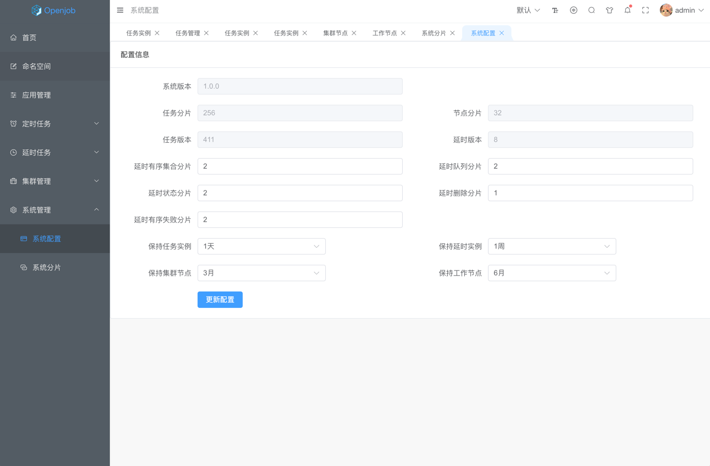

# 系统配置

- 系统版本: 当前系统版本
- 任务分片: 当前系统分片数
- 节点分片: 工作节点分配数
- 任务版本: 集群通信版本号，用于集群通信，一直自增。
- 延时版本: 延时任务版本号，用于工作节点与集群通信。
- 延时有序集合分片: 当前延时任务有序集合分片数
- 延时队列分片: 当前延时队列分片数
- 延时状态分片: 当前延时任务状态分片数
- 延时删除分片: 当前延时任务删除分片数
- 延时有序失败分片: 当前有序集合失败分片数。
- 保持任务实例: 保留最近多少天执行完成的任务实例，周期性定时清理历史数据。
- 保持延时实例: 保留最近多少天执行完成的延时实例，周期性定时清理历史数据。
- 保持集群节点: 保留最近多少天未在线的集群节点，周期性定时清理历史数据。
- 保持工作节点: 保留最近多少天未在线的工作节点，周期性定时清理历史数据。

:::tip
- 系统分片数默认 256 绝大多少情况以满足，如果不满足请提前规划，服务运行后修改，会迁涉及历史任务迁移。
- 延时任务相关配置修改时，只会影响新的任务，不需要迁移历史任务。
- 数据清理参数修改后，只会影响第二天生效，定时清理任务默认每天执行一次。
:::